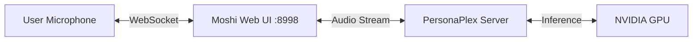

# Nvidia PersonaPlex (Moshi) Integration Guide

## Overview
PersonaPlex (Moshi) is a full-duplex speech-to-speech AI model that allows for natural, interrupted conversations. Unlike traditional TTS/STT pipelines, Moshi processes audio directly.

## Integration Status
- **Service**: Runs on port `8998` (Managed by `service_manager.py`).
- **Interface**: Web UI (WebSocket based).
- **Backend Code**: `core/voice/moshi_engine.py` acts as a bridge/check.

## Architecture


## How to Use

### 1. Start the Server
The easiest way is using the Service Manager:
```bash
python scripts/service_manager.py monitor
```
Or manually:
```bash
source .moshi-venv/bin/activate
python -m moshi.server --port 8998
```

### 2. Access the Interface
Open **[http://localhost:8998](http://localhost:8998)** in your browser.

### 3. Voice & Persona Configuration
You can customize the interaction using the Web UI controls:
- **Voice**: Select from `NATF0` (Natural Female), `NATM0` (Natural Male), etc.
- **System Prompt**: "You are a helpful assistant named Sarah."

## Python Integration
Since Moshi uses a complex WebSocket protocol for audio streaming, we do not currently use it for backend-generated TTS (like for WhatsApp).

For **WhatsApp Voice**, we use LiquidAI (or other providers) via `core/voice/liquid_engine.py`.
For **Real-time Voice Chat**, we direct users to the Moshi Web UI.

## Troubleshooting
- **No Audio**: Ensure microphone permissions are granted to `localhost:8998`.
- **Latency**: Requires a GPU with good FP16 performance (e.g., RTX 3090/4090, A100).
- **GPU OOM**: If vLLM and Moshi fight for VRAM, ensure you have at least 24GB VRAM total, or run them on separate GPUs (export `CUDA_VISIBLE_DEVICES`).
