# OmniCortex Project Flow

Last updated: 2026-03-16

## 1. Runtime Topology

| Component | Purpose | Default Port |
|---|---|---|
| FastAPI (`api.py`) | Main API, RAG, auth, voice proxy | `8000` |
| vLLM1 | Primary text LLM backend (`MODEL_BACKENDS.default`) | `8080` |
| vLLM2 (optional) | Secondary LLM backend/profile | `8082` |
| Moshi / PersonaPlex (`moshi.server`) | Full-duplex voice engine + web UI | `8998` |
| Voice Gateway (`scripts/voice_gateway.py`) | FreeSWITCH media bridge (`/calls`) | `8099` (or `443` TLS) |
| PostgreSQL + pgvector | Primary data store and vectors | `5432` |
| ClickHouse (optional) | Usage/chat/agent-event analytics sink | `8123` |

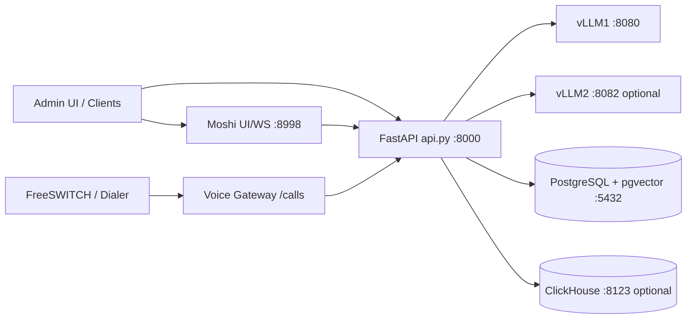

## 2. Core Backend Responsibilities

- `api.py`: REST and WS endpoints, startup validation, auth/ownership enforcement, orchestration.
- `core/agent_manager.py`: agent CRUD and vector store delete on agent removal.
- `core/chat_service.py`: chat pipeline (guardrails, PII masking, cache, retrieval, LLM invoke, persistence).
- `core/rag/*`: embeddings, vector store ops, hybrid retrieval (vector + keyword + RRF, optional rerank).
- `core/llm.py`: OpenAI-compatible LLM invocation via LangChain (`MODEL_BACKENDS` driven).
- `core/database.py`: SQLAlchemy models, schema/index setup, message/document/usage storage.
- `core/clickhouse.py`: buffered async analytics writing (usage/chat/agent events).
- `scripts/voice_gateway.py`: `/calls` WS bridge between telephony media and OmniCortex `/voice/ws`.
- `personaplex/moshi/moshi/server.py`: PersonaPlex runtime, OmniCortex-aware agent/prompt fetch, UI patching.

## 3. End-to-End Flows

### 3.0 Consolidated Project Flow

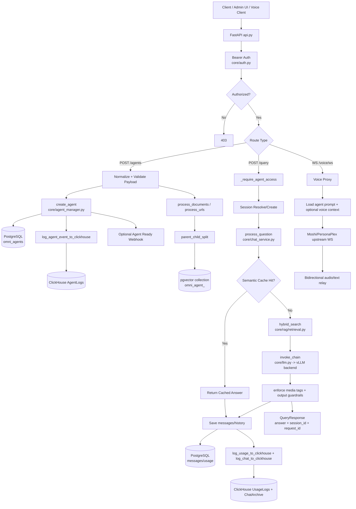

### 3.1 Agent create and ingest flow

1. Client calls `POST /agents` with Bearer token.
2. API validates owner identity and normalizes payload (`agent_type`, `subagent_type`, prompts, model selection).
3. Agent row is created in `omni_agents`.
4. Optional ingestion runs from:
   - `file_paths` / uploaded files
   - `documents_text`
   - `scraped_data`
5. URL list triggers background `process_urls(...)`.
6. `process_documents(...)` performs:
   - extraction and text combine
   - parent-child split
   - parent chunk save in Postgres
   - child embedding + vector upsert in pgvector collection `omni_agent_<agent_id>`
7. Agent event is logged to ClickHouse (if enabled).
8. Optional outbound webhook `AGENT_READY_WEBHOOK_URL` is called.

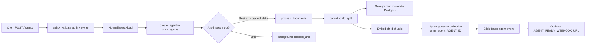

### 3.2 Text query flow (`POST /query`)

1. Request is authenticated and agent ownership is checked.
2. Session is resolved/created (daily policy per `agent + user + channel` when absent).
3. `process_question(...)` pipeline:
   - input guardrails
   - PII masking
   - rule-based greeting/end response from agent-specific `conversation_starters` / `conversation_end`
   - semantic cache lookup
   - hybrid retrieval (`hybrid_search`)
   - context/history formatting
   - LLM call (`invoke_chain`) to selected backend/model
   - output guardrails
   - cache save + message persistence
4. Response tags are normalized and rendered for frontend (`[image]`, `[video]`, `[document]`, `[buttons]`, etc).
5. Usage/chat analytics are written to Postgres and optionally ClickHouse.

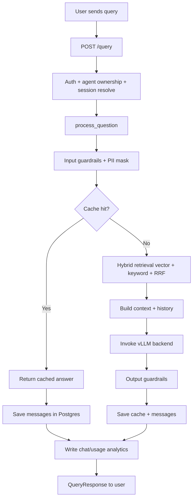

### 3.3 Voice flow through OmniCortex proxy (`/voice/ws`)

1. Voice client connects to `ws://<api>:8000/voice/ws` with token (query/header), `agent_id`, `voice_prompt`.
2. API authenticates token via external auth callback.
3. If `agent_id` is present, API loads agent system prompt.
4. If `VOICE_RAG_ENABLED=true`, API retrieves top-k vector context and appends it into voice prompt.
5. API opens upstream WS to Moshi `/api/chat` and relays binary frames bidirectionally.
6. Client receives AI audio frames and text/control frames as streamed by Moshi.

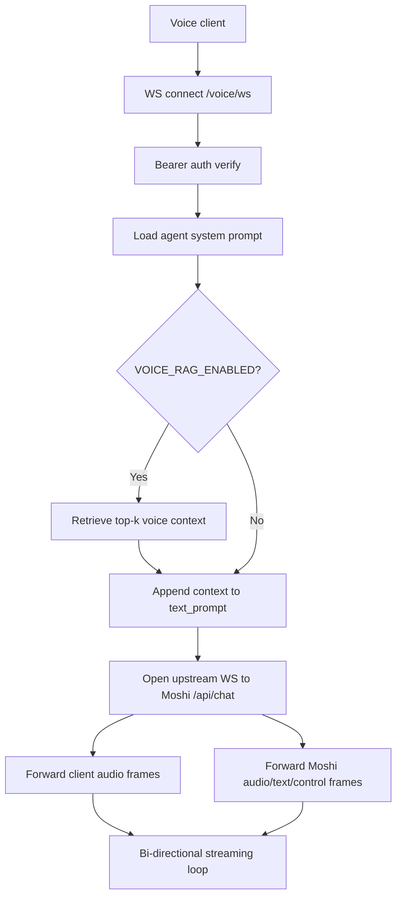

### 3.4 Telephony flow via Voice Gateway (`/calls`)

1. FreeSWITCH/dialer connects to Voice Gateway endpoint (`/calls`).
2. Gateway opens upstream WS to OmniCortex `/voice/ws` with agent/token/voice params.
3. Audio bridge behavior:
   - inbound FS PCM16 -> resample -> Opus -> Moshi audio frame `0x01`
   - upstream audio frame `0x01` -> Opus decode -> resample -> PCM16 back to FS
   - text/control frames are forwarded or logged based on config
4. This keeps telephony media adaptation outside `api.py`.

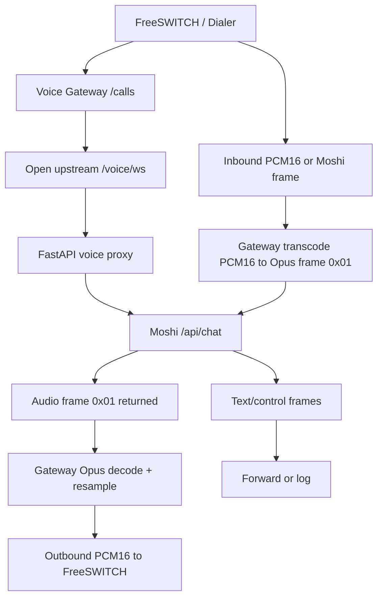

### 3.5 Moshi UI agent mode flow

1. Browser opens Moshi UI (`:8998`).
2. UI patch (enabled by default) replaces stock examples with OmniCortex agents.
3. UI calls:
   - `/api/agents` (Moshi server -> OmniCortex `/agents`)
   - `/api/agent-prompt` (Moshi server -> OmniCortex `/agents/{id}` + `/agents/{id}/voice-context`)
4. Voice websocket `/api/chat` carries selected `agent_id` and optional `omni_bearer`.

```mermaid
flowchart LR
  A[Browser opens Moshi UI :8998] --> B[Injected UI patch]
  B --> C[Examples label becomes Agents]
  C --> D[/api/agents]
  D --> E[Moshi server fetch_agents]
  E --> F[OmniCortex /agents]
  C --> G[Agent chip selected]
  G --> H[/api/agent-prompt]
  H --> I[Moshi fetch_agent_prompt]
  I --> J[OmniCortex /agents/id + /voice-context]
  J --> K[Text prompt textarea populated]
  K --> L[WS /api/chat with agent_id]
```

### 3.6 Voice Diagrams (Separated)

#### 3.6.1 Voice WS sequence (`/voice/ws`)

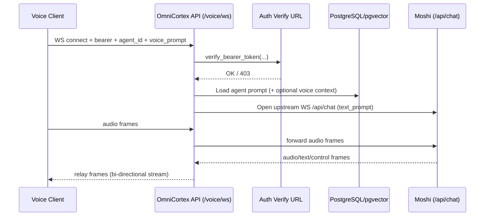

#### 3.6.2 Telephony bridge sequence (`/calls` via Voice Gateway)

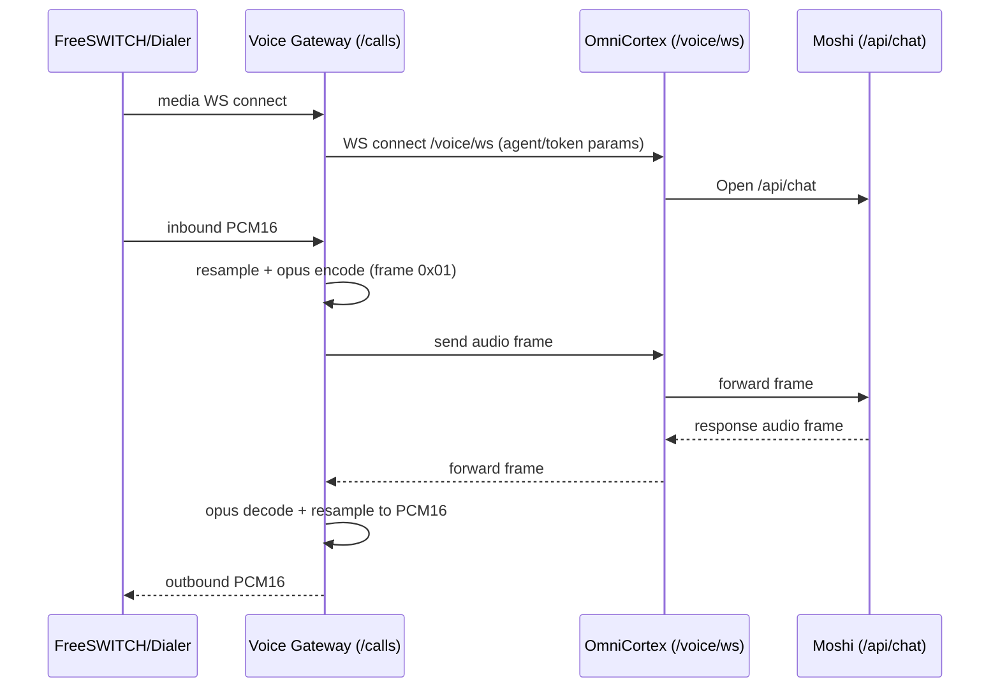

#### 3.6.3 Moshi UI agent mode sequence

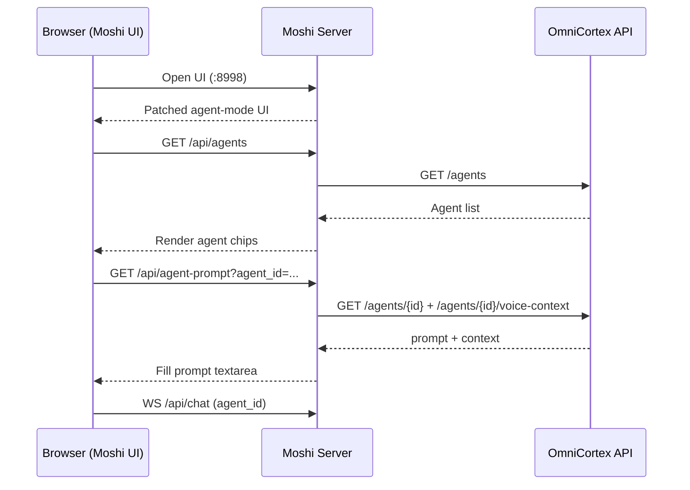

## 4. Data and Isolation Model

- Agent ownership isolation is enforced at API level per Bearer identity.
- Vector collection isolation is per-agent: `omni_agent_<agent_id>`.
- Core tables:
  - `omni_agents`
  - `omni_documents`
  - `omni_messages`
  - `omni_usage`
  - `omni_parent_chunks`
  - `omni_semantic_cache`

### 4.1 Agent YAML snapshots

- Path: `storage/agents/<agent_name>/config.yaml`
- Written/updated on:
  - `POST /agents` (event `create`)
  - `PUT /agents/{id}` (event `update`)
  - successful LLM usage logging (usage totals sync)
- Contains:
  - current agent configuration snapshot
  - lifecycle event history (`create`/`update`)
  - cumulative token totals:
    - `total_input_tokens` (prompt tokens)
    - `total_output_tokens` (completion tokens)
    - `total_query_tokens`
    - `total_rag_query_tokens`

## 5. Auth and Security Boundaries

- Main API auth: external bearer verification (`AUTH_VERIFY_URL`).
- `/voice/ws` also requires bearer token.
- Moshi auth is separate (`MOSHI_API_TOKEN`) for its own endpoints.
- Moshi -> OmniCortex calls can use server-side key (`OMNICORTEX_API_KEY`) or per-user `omni_bearer`.

## 6. Observability and Health

- `/health` reports database, LLM backend, and Moshi status with short cache TTL.
- Query traces written to `storage/logs/query_trace.log`.
- WhatsApp logs written to `storage/logs/whatsapp.log`.
- ClickHouse writer uses in-memory buffers with periodic flush and drop-on-unavailable behavior.

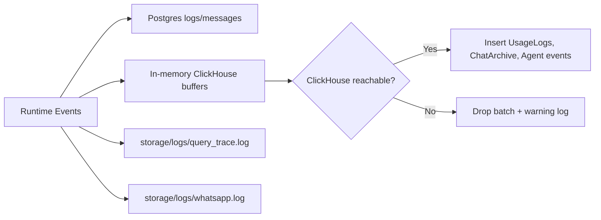

## 7. Recommended Startup Order

1. Start PostgreSQL (+ pgvector) and optional ClickHouse.
2. Start vLLM1 on `8080`.
3. Start FastAPI on `8000`.
4. Start Moshi on `8998` (if voice needed).
5. Start Voice Gateway on `8099` or `443` (if FreeSWITCH integration is needed).

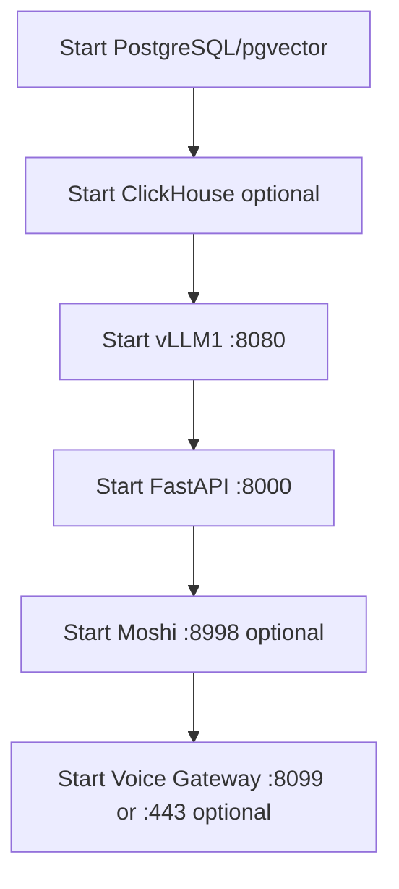
